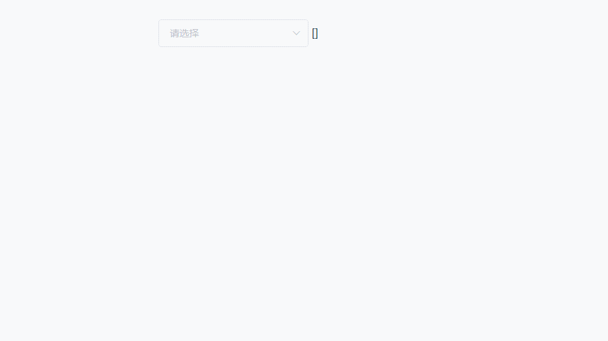

# bl-select

### 基于element UI下el-select的拼音检索
需要装 elementUI
### 安装
`npm i bl-select`
### 使用
在main.js加
```
import BlSelect from 'bl-select'
Vue.use(BlSelect)
```
使用的地方   
template部分
```
<bl-select
    v-model="value"
    :options="options"
    :props="{label:'label', value:'value'}"
/>
```
js部分
```js
data() {
      return {
        value: '',
        options: [
          {
            label: '张三',
            value: 1
          },
          {
            label: '李四',
            value: 2
          }
        ]
      }
    }
```
### 属性Props 

属性 | 类型 | 默认值 | 说明
---|---|---|---
multiple | Boolean | false|是否多选，默认单选
filterable | Boolean | true |是否支持检索，默认true，无需配置。功能已经实现
clearable | Boolean | false | 是否可清空 同el-select
disabled | Boolean | false | 是否禁用bl-select
fieldDisabled | String |  | option禁用字段
options | Array | - | 列表数据
row | Boolean |false | 是否选中option（设置该值后，change方法会打印一个包含options(列表数据)的某一项）
props | Object | - | label和value的配置 见下表
all | Boolean | false|是否显示全选（multiple为true的前提下）
all-text | String | 全选 |全选文本（默认是全选）

## props（label、value配置）
属性 | 值
---|---
label | 设置label
value | 设置的value

## 方法
方法名 | 说明
---|---
change| 返回 value的值。如果设置了row 则返回一个对象
select-all | 全选事件
on-option | 获取当前选择数据的完整信息

## 全选方法实现
html    
```html
<bl-select
  v-model="value"
  clearable
  multiple
  collapse-tags
  all
  :all-text="allText"
  :options="options"
  :props="{
    value: 'value',
    label: 'label'
  }"
  @change="change"
  @select-all="selectAll"
  @remove-tag="removeTag"
/>
{{ value }}
```
js
```js
export default {
  name: 'App',
  components: {},
  data() {
    return {
      value: '',
      options: [{
        value: '1',
        label: '黄金糕'
      }, {
        value: '2',
        label: '双皮奶'
      }, {
        value: '3',
        label: '北京糖葫芦'
      }, {
        value: '4',
        label: '蚵仔煎'
      }, {
        value: '5',
        label: '龙须面'
      }, {
        value: '6',
        label: '北京烤鸭'
      }],
      allText: '全选'
    }
  },
  methods: {
    selectAll() {
      if (this.value.length < this.options.length) {
        this.value = []
        this.options.forEach(item => {
          this.value.push(item.value)
        })
        this.value.unshift(this.allText)
      }
    },
    change(val) {
      if (!val.includes(this.allText) && this.value.length === this.options.length) {
        this.value.unshift(this.allText)
      } else if (val.includes(this.allText) && val.length - 1 < this.options.length) {
        this.value = this.value.filter(item => item !== this.allText)
      }
    },
    removeTag(val) {
      if (val === this.allText) {
        this.value = []
      }
    }
  }
}
```